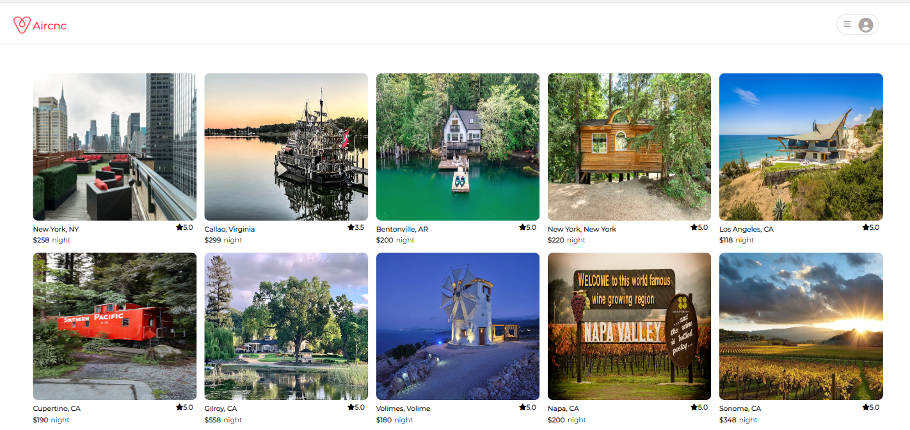

# AirCnC

AirCnC is a website clone inspired by [AirBnB](https://www.airbnb.com/). It is an online marketplace for  users to offer or find vacation rentals around the world.

**Live site: [AirCnC](https://cici-airbnb.herokuapp.com/)**

## Wiki Link

 - [API Documentation](https://github.com/cici1819/AirBnB-API-project/wiki/API-Documentation)
 - [Database Schema](https://github.com/cici1819/AirBnB-API-project/wiki/Database-Schema)
 - [Features List](https://github.com/cici1819/AirBnB-API-project/wiki/Features)
 - [Redux Store Shape](https://github.com/cici1819/AirBnB-API-project/wiki/Redux-Store-shape)

## Tech Stack
### This project is build with:
#### Frameworks, Platforms, & Libraries:

## Features

### HomePage

Users are able to view all spot information and click on a spot to see spot details.

### Home Page drop-down menu:
Users can log in and sign up

### Log In:

### Sign Up:

### Demo User:

### Spot Details Page:

### Create a Spot
Registered user can create a new spot by clicking the "Become a Host"  on the navigation bar.

### Manage Your Spots

A logged in user is able to view all of their spots as well as update and delete spots. Clicking the drop down menu, 
then clicking "My Spots" in the drop down menu.

##### Edit a Spot
User can edit their owen spots by clicking on the "Edit Spot" button in "My Spots"

##### Delete a Spot
User can delete their owen spots by clicking on the "Delete Spot" button in "My Spots"

### Manage Your Reviews
A logged in user is able to view all of their reviews as well as delete their reviews. Clicking the drop down menu, then clicking "My Reviews" in the drop down menu.

##### Delete a Review

### Add Review
User can create a new review for the spot which are not belong to  themselves  or have already reviewed, by clicking  the "Add Review" button on the spot detail page.

## Contact Information
